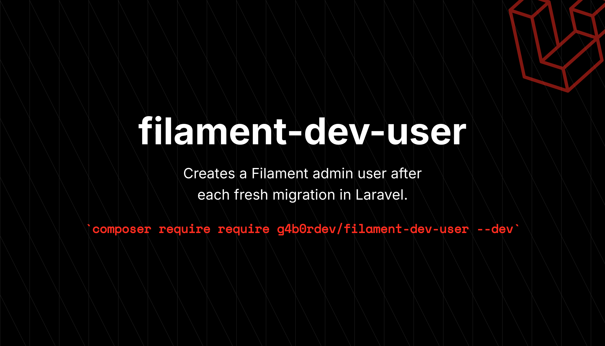

# Filament DevUser



[](https://packagist.org/packages/g4b0rdev/filament-dev-user)
[](https://github.com/g4b0rdev/filament-dev-user/actions?query=workflow%3Arun-tests+branch%3Amain)
[](https://github.com/g4b0rdev/filament-dev-user/actions?query=workflow%3A"Fix+PHP+code+style+issues"+branch%3Amain)
[](https://packagist.org/packages/g4b0rdev/filament-dev-user)

This package provides a simple way to create a development user for Filament Admin Panel in Laravel applications.
It allows you to quickly set up an admin user with predefined credentials for testing and development purposes.

> **Note:** This package is intended for development and testing purposes only. It should not be used in production environments.

> **Warning:** This package is under active development and may change in future releases. Please use it with caution.

## Installation

You can install the package via composer:

```bash
composer require g4b0rdev/filament-dev-user --dev
```

## Configuration

Define the user credentials in your `.env` file:

```dotenv
FILAMENT_ADMIN_EMAIL=""
FILAMENT_ADMIN_PASSWORD=""
FILAMENT_ADMIN_NAME=""
```

You can publish the config file with:

```bash
php artisan vendor:publish --tag="filament-dev-user-config"
```

This is the contents of the published config file:

```php
<?php

declare(strict_types=1);

return [
    /*
    |--------------------------------------------------------------------------
    | Test User Configuration
    |--------------------------------------------------------------------------
    |
    | Configure the default admin user credentials that will be created
    | automatically when running migrations in local or testing environments.
    |
    */
    'user' => [
        'admin_email' => env('FILAMENT_ADMIN_EMAIL', 'test@example.com'),
        'admin_password' => env('FILAMENT_ADMIN_PASSWORD', 'password'),
        'admin_name' => env('FILAMENT_ADMIN_NAME', 'admin'),
    ],

    /*
    |--------------------------------------------------------------------------
    | User Model Configuration
    |--------------------------------------------------------------------------
    */
    'user_model' => App\Models\User::class,
];
```

## Usage

On every `migrate` command the package will check if the user exists, and if not, it will create a new user with the credentials defined in the config file.

```sh
php artisan migrate
```

## Testing

```bash
composer test
```

## Changelog

Please see [CHANGELOG](CHANGELOG.md) for more information on what has changed recently.

## Contributing

Please see [CONTRIBUTING](CONTRIBUTING.md) for details.

## Security Vulnerabilities

Please review [our security policy](../../security/policy) on how to report security vulnerabilities.

## Credits

- [G4b0rDev](https://github.com/G4b0rDev)
- [All Contributors](../../contributors)

## License

The MIT License (MIT). Please see [License File](LICENSE.md) for more information.
